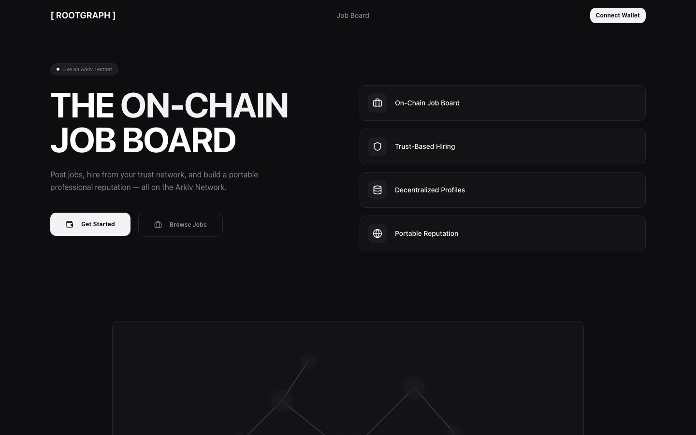
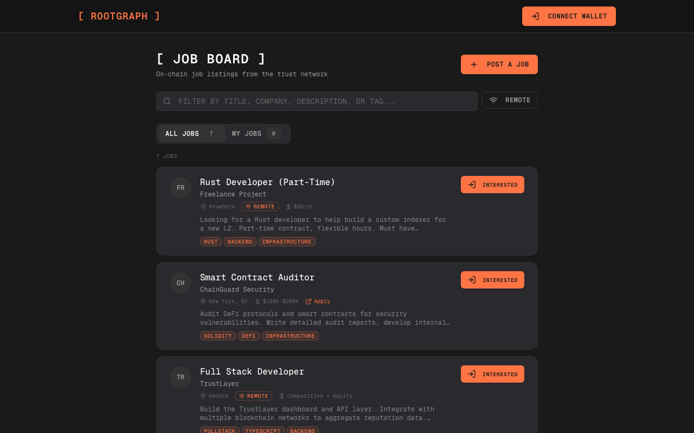

# RootGraph — The On-Chain Job Board

RootGraph is a decentralized professional network and job board built on the [Arkiv Network](https://arkiv.network). Post jobs, hire from your trust network, and build a portable professional reputation — all stored on-chain.

Built for the **Arkiv Web3 Database Builders Challenge 2026**.

## Screenshots

**Landing Page** — The main entry point with feature overview and animated trust graph preview.



**Job Board** — Browse on-chain job listings with salary, tags, remote filter, and description search.



## Features

- **On-Chain Job Board** — Post and discover jobs stored as Arkiv entities. Listings are transparent, censorship-resistant, and queryable by any app.
- **Trust-Based Hiring** — Hire from your connection graph. Connections are cryptographically verified on-chain.
- **Decentralized Profiles** — Your professional identity lives on Arkiv. You own it completely.
- **Company Profiles** — Create and manage company pages with name, description, website, and tags. Publicly viewable by wallet address.
- **Salary Display** — Job listings include optional salary information for transparency.
- **Community Flagging** — Flag suspicious job listings for community review with on-chain accountability.
- **Interactive Trust Map** — Visualize the entire network as a force-directed graph.
- **Portable Reputation** — Your trust graph is composable. Other apps can read your data directly from Arkiv.

## Arkiv Integration

RootGraph stores **all data** as Arkiv entities on the Kaolin testnet (L2 on Hoodi). There is no traditional database.

### Entity Types

| Entity | Attributes | Description |
|---|---|---|
| `profile` | `wallet`, `username`, `entityType`, `app` | User professional profiles with display name, position, company, tags |
| `connection` | `userA`, `userB`, `entityType`, `app` | Bidirectional trust connections between wallets |
| `connection-request` | `fromWallet`, `toWallet`, `status`, `entityType`, `app` | Pending connection requests |
| `job` | `postedBy`, `status`, `isActive`, `entityType`, `app` | Job postings with title, company, location, description, tags, salary, remote flag |
| `job-application` | `jobKey`, `applicantWallet`, `entityType`, `app` | Expressions of interest linking applicants to jobs |
| `company` | `wallet`, `entityType`, `app` | Company profiles with name, description, website, tags |
| `job-flag` | `jobKey`, `flaggerWallet`, `entityType`, `app` | Community flags on suspicious job listings |

### SDK Usage

- **`@arkiv-network/sdk`** — Entity creation, updates, and queries via `createPublicClient` and `createWalletClient`
- **`@arkiv-network/sdk/query`** — `eq()` for attribute-based filtering
- **`@arkiv-network/sdk/utils`** — `jsonToPayload()` for entity payloads, `ExpirationTime` for TTLs
- **`@arkiv-network/sdk/chains`** — `kaolin` chain config (chain ID `60138453025`)

All queries use the `buildQuery()` API with attribute filters. Profiles and connections expire after 2 years; jobs and applications after 90 days; connection requests after 30 days.

### Data Flow

```
User Action → Privy Wallet → Arkiv SDK → Kaolin Testnet (on-chain)
                                ↓
                        Query via buildQuery()
                                ↓
                        Attribute-based filtering (eq)
                                ↓
                        JSON payload deserialization
```

## Privacy Layer

RootGraph includes an optional privacy layer for salary encryption and encrypted application messages.

### Key Derivation

When a user enables encryption in Settings, they sign a deterministic message with their wallet. The signature is fed through HKDF to derive:

- **NaCl keypair** (X25519) — for asymmetric encryption of application messages between applicant and poster
- **Symmetric key** (XSalsa20-Poly1305) — for encrypting exact salary amounts (poster-only decryption)

Keys are cached in `sessionStorage` for the tab lifetime and cleared on close.

### Encrypted Salary

- Exact salary is encrypted with NaCl `secretbox` using the poster's symmetric key
- A public salary range bracket (e.g., $100k–$150k) is auto-calculated and stored in plaintext
- Only the job poster can decrypt and view the exact amount

### ZK Salary Range Proofs (Best-Effort)

A Noir circuit (`salary_range`) can generate a zero-knowledge proof that the exact salary falls within the stated range, without revealing the amount. This requires Barretenberg WASM with `SharedArrayBuffer`, which needs COOP/COEP headers that conflict with Privy auth iframes. If proof generation fails, the job posts normally with the encrypted salary and public range — no proof attached.

### Encrypted Application Messages

When both applicant and poster have encryption enabled, application messages are encrypted with NaCl `box` (X25519 + XSalsa20-Poly1305). If the poster hasn't enabled encryption, the message is omitted rather than sent in plaintext.

## Tech Stack

- **Next.js 14** (App Router) — Framework
- **Arkiv SDK** (`@arkiv-network/sdk` v0.6.2) — On-chain data layer
- **Privy** (`@privy-io/react-auth`) — Wallet connection and authentication
- **Zustand** — Client-side state management
- **Tailwind CSS** + **shadcn/ui** — Styling and components
- **react-force-graph-2d** — Trust map visualization
- **TypeScript** — Full type safety

## Getting Started

### Prerequisites

- Node.js 18+
- npm

### Setup

```bash
# Clone the repository
git clone https://github.com/LucianoLupo/rootgraph-arkiv-mvp.git
cd rootgraph-arkiv-mvp/app

# Install dependencies
npm install

# Configure environment
cp .env.example .env.local
# Edit .env.local and add your Privy App ID (get one at https://dashboard.privy.io/)

# Start development server
npm run dev
```

Open [http://localhost:3000](http://localhost:3000) to see the app.

### Scripts

| Command | Description |
|---|---|
| `npm run dev` | Start development server |
| `npm run build` | Production build |
| `npm run lint` | Run ESLint |
| `npm run seed` | Seed demo data on Kaolin testnet |
| `npm run test:jobs` | Run job board integration tests against Kaolin |

## Project Structure

```
app/
├── src/
│   ├── app/
│   │   ├── page.tsx                    # Landing page
│   │   └── (app)/
│   │       ├── layout.tsx              # App shell with sidebar nav
│   │       ├── dashboard/page.tsx      # Dashboard with stats
│   │       ├── jobs/
│   │       │   ├── page.tsx            # Job board listing
│   │       │   ├── post/page.tsx       # Post a job form
│   │       │   └── [id]/
│   │       │       ├── page.tsx        # Job detail + applications
│   │       │       └── edit/page.tsx   # Edit job form
│   │       ├── search/page.tsx         # Search profiles
│   │       ├── connections/page.tsx    # Manage connections
│   │       ├── company/page.tsx        # Company profile management
│   │       ├── company/[wallet]/page.tsx # Public company view
│   │       ├── profile/[wallet]/       # Public profile view
│   │       ├── trustmap/page.tsx       # Interactive trust graph
│   │       └── settings/page.tsx       # Edit own profile
│   ├── lib/
│   │   ├── arkiv.ts                    # All Arkiv SDK operations
│   │   ├── store.ts                    # Zustand state management
│   │   └── utils.ts                    # Utility functions
│   ├── providers/
│   │   └── arkiv-provider.tsx          # Wallet client context
│   ├── hooks/                          # Custom React hooks
│   └── components/ui/                  # shadcn/ui components
├── scripts/
│   ├── seed-demo.ts                    # Demo data seeder
│   ├── seed-jobs-companies.ts          # Seed companies, jobs, and flags
│   └── test-jobs.ts                    # Job board integration tests
└── package.json
```

## Network

- **Chain**: Kaolin (Arkiv L2 on Hoodi)
- **Chain ID**: `60138453025`
- **RPC**: `https://kaolin.hoodi.arkiv.network/rpc`
- **Explorer**: `https://explorer.kaolin.hoodi.arkiv.network`
- **Faucet**: `https://kaolin.hoodi.arkiv.network/faucet/`

## License

MIT — see [LICENSE](./LICENSE)
